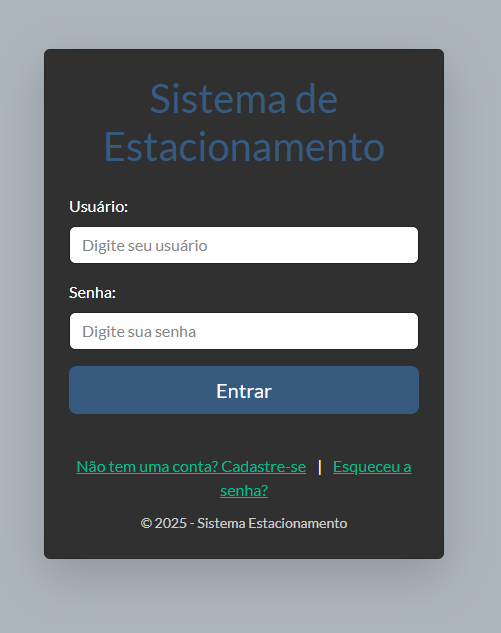
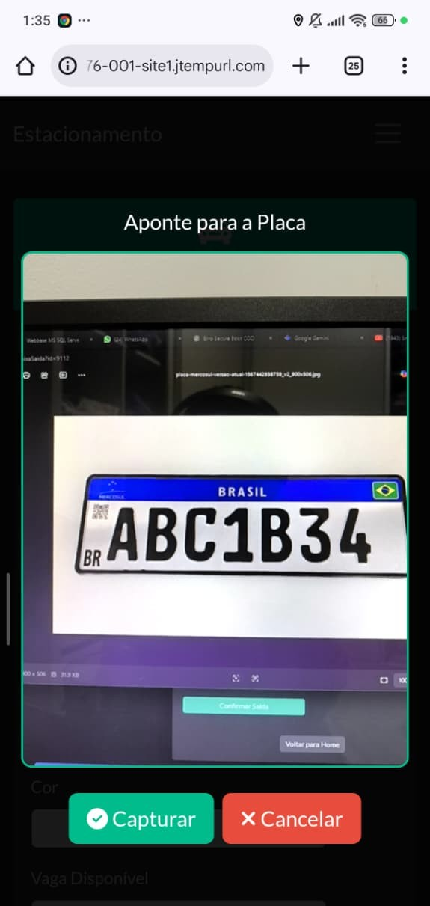

# 🚗 EstacionamentoMaster: Gestão Inteligente para Centros Automotivos

> **Sistema comercial desenvolvido para otimização operacional de lava-rápidos e estacionamentos, focado em controle de fluxo, segurança de dados e fidelização de clientes.**

O **EstacionamentoMaster** é uma solução completa que transforma a complexidade do dia a dia automotivo em um fluxo digital organizado. Projetado para atender demandas reais de operação, o sistema elimina controles em papel, automatiza cálculos de permanência e oferece uma camada de auditoria para proteção do proprietário.

🌐 **Acesse o sistema online:** [http://henriquedgs76-001-site1.jtempurl.com/](http://henriquedgs76-001-site1.jtempurl.com/)

---

## 🖥️ O Produto em Operação

### 🔐 Gestão de Acessos e Segurança
Sistema robusto de autenticação com perfis de permissão (Admin, Supervisor e Operador). Garante que cada colaborador acesse apenas as funções necessárias para seu cargo.

### 📊 Business Intelligence & Retenção
Dashboard gerencial com indicadores financeiros e de ocupação. O sistema possui um motor de busca ativa que identifica **clientes ausentes há mais de 15 dias**, gerando insights para campanhas de fidelização.

### 📸 Check-in por Reconhecimento de Placa (OCR)
Otimização da entrada de veículos através da leitura automática de placas utilizando a câmera do dispositivo móvel. O sistema processa a imagem em tempo real, identifica os caracteres e realiza a busca automática no banco de dados para agilizar o atendimento de clientes recorrentes.
)

---

## ✨ Funcionalidades Profissionais

* **Módulo de Auditoria Nativo:** Rastreabilidade total de eventos. O sistema registra logs detalhados de quem adicionou, editou, excluiu ou deu baixa em cada veículo, prevenindo erros e fraudes.
* **Check-in Inteligente:** Reconhecimento de placa para preenchimento automático de dados de clientes recorrentes, reduzindo drasticamente o tempo de recepção.
* **Precificação Flexível:** Suporte a cobrança por tempo de permanência (estacionamento) conjugada com serviços de estética (lavagem, polimento) com preços fixos ou variáveis.
* **Integridade Transacional:** Implementação de transações em nível de banco de dados para garantir que a baixa financeira e a liberação da vaga ocorram de forma atômica e segura.

---

## 🛠️ Especificações Técnicas

O sistema foi construído seguindo o padrão de **Arquitetura em Camadas (N-Tier)**, garantindo estabilidade e facilidade para futuras manutenções.

| Camada | Tecnologia | Implementação |
| :--- | :--- | :--- |
| **Interface** | `Bootstrap 5`, `JavaScript` | Layout responsivo focado na usabilidade operacional via mobile. |
| **Backend** | `C# / .NET Framework` | Regras de negócio centralizadas na camada BLL. |
| **Dados** | `SQL Server / ADO.NET` | Persistência segura com foco em integridade referencial. |

---

## 🗄️ Estrutura de Dados Principal

* **`Veiculos`**: Gerencia o ciclo de vida completo do atendimento.
* **`Auditoria`**: Histórico imutável de operações por usuário para conformidade.
* **`Vagas`**: Gestão lógica do inventário físico em tempo real.
* **`Servicos`**: Catálogo parametrizável de ofertas, serviços e tabelas de preços.

---

## 👨‍💻 Sobre o Desenvolvedor

**Douglas Henrique** *Desenvolvedor de Software focado em soluções para o mundo real.*

📍 Campinas – SP
